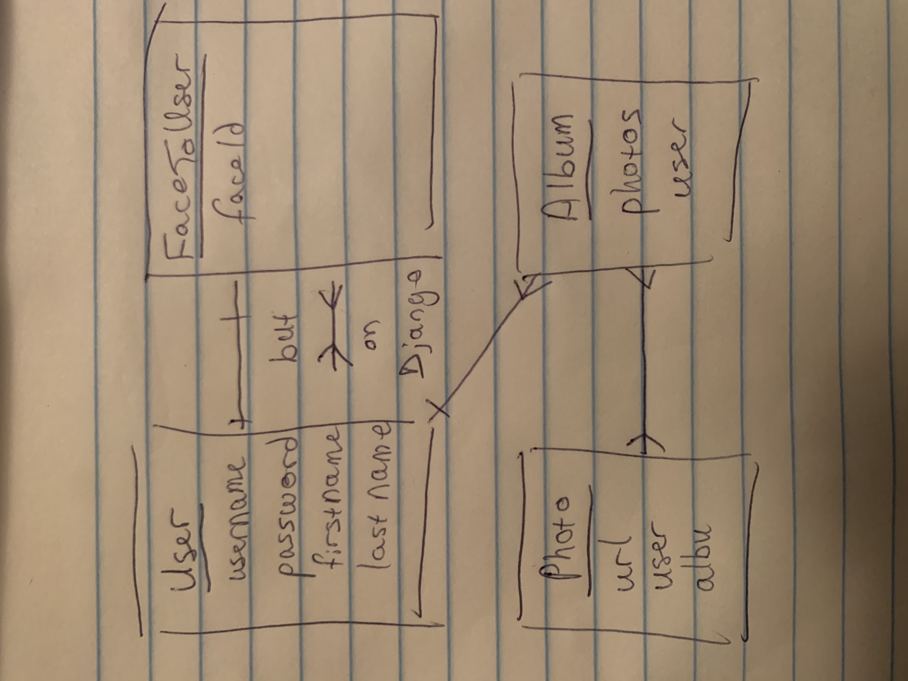
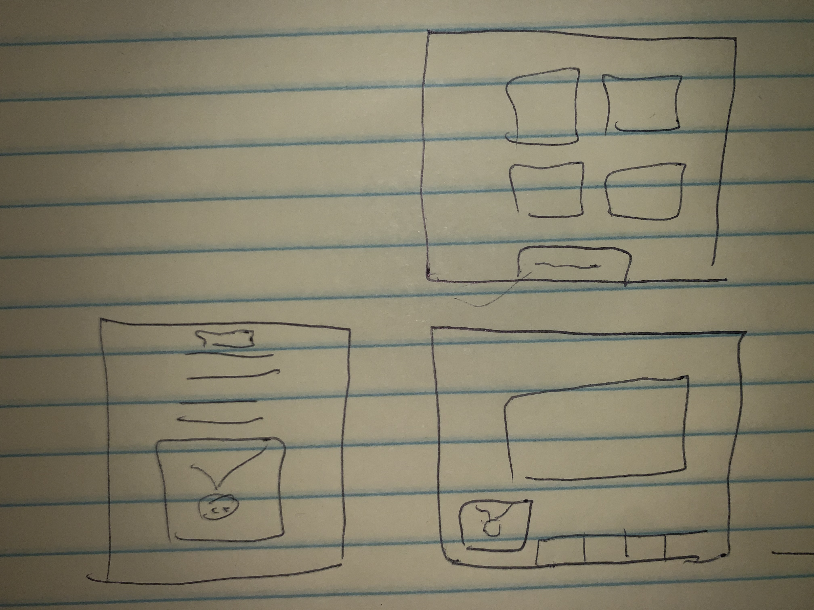
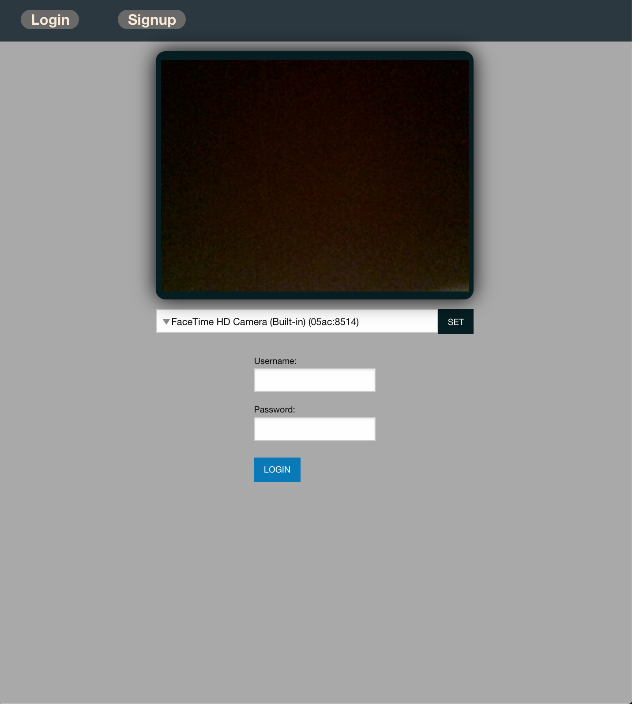
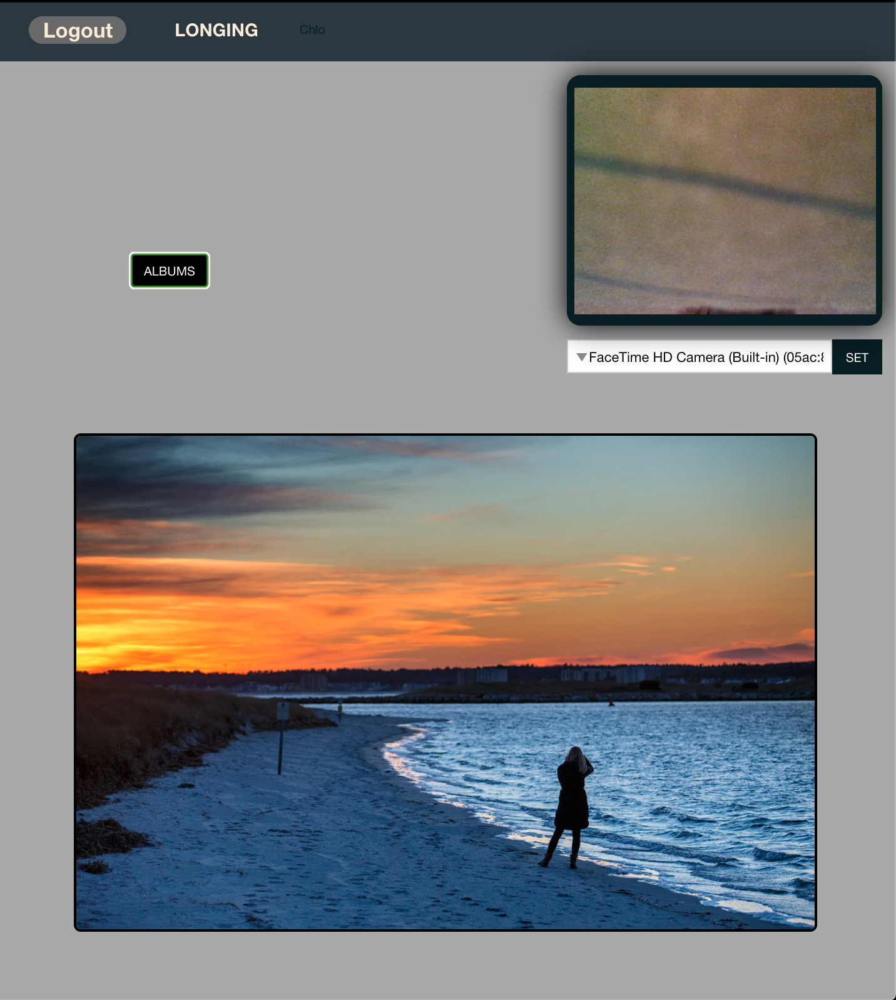
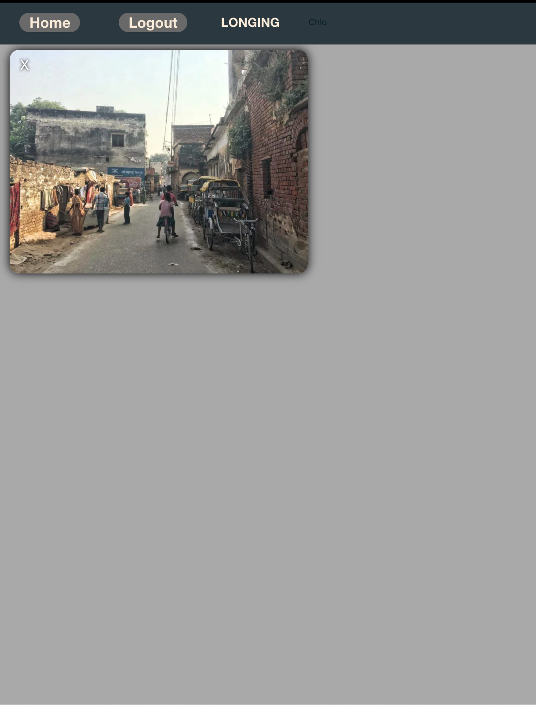

## LONGING
or, to catch a feeling

Objective:
\
Interpret the user's feeling and use it to categorize or sort resources or market to that. 

Features:
\
* Auth/Login by Face
* Emotion recognition
* Auto addition of photos/creation of user albums

ERD:

Wireframes:

Screenshots:

### Technologies Used:
- python
- django
- javascript
- html
- css
- django-channels
- open cv
- numpy
- boto3
- aws
- Foundation CSS

[mysite](https://longing-feelings.herokuapp.com)

